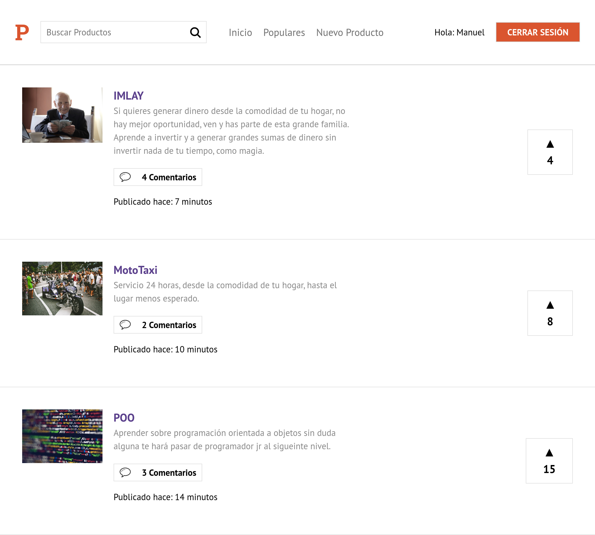

# App clon del sitio Product Hunt

Simulando un clon del sitio Product Hunt, el cual consiste en crear productos y ofrecerlos a los demás usuarios, creado con NextJs, ReactJs y Firebase para la autenticación.

## Empezar

* `yarn` para instalar dependencias.
* `yarn run dev` para entorno de desarrollo.
* `yarn run build && yarn start` para entorno de producción.
* `yarn run export` para generar el build.

## Licencia

MIT

## Sitio

https://mr-producthome.vercel.app

